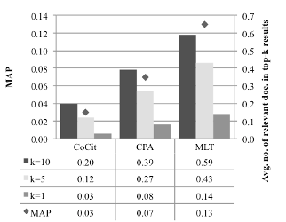
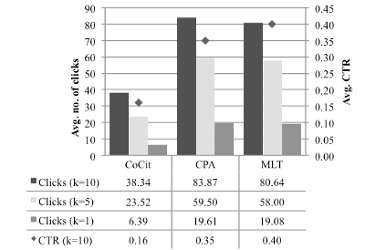

# Citolytics - Citation Analysis for Wikipedia with Apache Flink

This repository contains all resources used in the research paper [Evaluating Link-based Recommendations for Wikipedia](https://github.com/wikimedia/citolytics/releases/download/v0.0.2/paper.pdf) including the [Apache Flink](https://flink.apache.org/) based implementation of [Co-Citation](https://en.wikipedia.org/wiki/Co-citation) (CoCit) and [Co-Citation Proximity Analysis](https://en.wikipedia.org/wiki/Co-citation_Proximity_Analysis) (CPA) for Wikipedia, the evaluation application with several performance measures, the final and intermediate result data sets and additional tools for testing and debugging.

The evaluation was performed on the English Wikipedia XML dump from [September 2014](https://archive.org/details/wikimedia-mediatar). Resources regarding the [Apache Lucence MoreLikeThis](https://lucene.apache.org/) baseline can be found in a [separate repository](https://github.com/mschwarzer/Wikipedia2Lucene).

[](https://drone.io/github.com/TU-Berlin/cpa-demo/latest)
### Contents

- CPA and CoCit computation on Wikipedia text corpus
- Extraction of "See also" link as gold standard
- "See also" and click stream based evaluation
- Performance evaluation with several measures
    - Mean Average Precision (default)
    - Top-K (always included)
    - Mean Reciprocal Rank (set [ENABLE-MRR] parameter)
    - Click Through Rate (default for click streams)
- Link graph extraction for result pairs
- Wikipedia article statistics generator

### Evaluation

See Also Evaluation | Clickstream Evaluation
:-------------------------:|:-------------------------:
 | 

We performed several evaluations on the recommendation quality of CPA, CoCit and MLT. Additional plots and raw and aggregated results can be found [here](evaluation).

### Run
- Compile the Maven project
- Run Apache Flink jobs separately from jar-file with -c parameter.

### Available Flink Jobs (Classes)
- **CPA/CoCit Computation**: de.tuberlin.dima.schubotz.wikisim.cpa.WikiSim
    - Parameters: WIKI-XML-DUMP OUTPUT ALPHA1,ALPHA2,... [REDUCER-THRESHOLD] [COMBINER-THRESHOLD] []
    - e.g.: hdfs://cluster/wikidump.xml hdfs://cluster/results.out 0.5,1.0,1.5,2.0 10 5

- **SeeAlsoEvaluation**: de.tuberlin.dima.schubotz.wikisim.seealso.SeeAlsoEvaluation
    - Parameters: WIKISIM-DATASET EVAL-OUTPUT SEEALSO-DATASET [LINKS/NOFILTER] [SCORE-FIELD] [PAGE1-FIELD] [PAGE2-FIELD] [ENABLE-MRR]
    - e.g.: hdfs://cluster/results.out hdfs://cluster/eval.out hdfs://cluster/seealso.out nofilter 8

- **SeeAlsoExtractor**: de.tuberlin.dima.schubotz.wikisim.seealso.SeeAlsoExtractor
    - Parameters: WIKI-XML-DUMP SEEALSO-OUTPUT REDIRECTS
    - e.g.: hdfs://cluster/wikidump.xml hdfs://cluster/seealso.out hdfs://cluster/redirects.out


- **Extract Redirects**: de.tuberlin.dima.schubotz.wikisim.redirects.RedirectExtractor
    - Parameters: WIKI-XML-DUMP REDIRECTS
    - e.g.: hdfs://cluster/wikidump.xml hdfs://cluster/redirects.out

- **ClickStreamEvaluation**: de.tuberlin.dima.schubotz.wikisim.clickstream.ClickStreamEvaluation
    - Parameters: WIKISIM-DATASET CLICKSTREAM-DATASET EVAL-OUTPUT [SCORE-FIELD]
    - e.g.: hdfs://cluster/results.out hdfs://cluster/wiki-clickstream.tsv hdfs://cluster/eval.out 6

- For more Flink jobs see [/support/flink-jobs.md](https://github.com/TU-Berlin/cpa-demo/blob/master/support/flink-jobs.md)
- For runtime information see [/support/runtimes.md](https://github.com/TU-Berlin/cpa-demo/blob/master/support/runtimes.md)
### Evaluation Example
To evaluate and generate the data used in our publication, you need to run the following Flink jobs in the order below. Paths to JAR and HDFS need to be adjusted depending on your setup.

#### 1. Extract Redirects from Wikipedia
```
./bin/flink run -c de.tuberlin.dima.schubotz.wikisim.redirects.RedirectExtractor \
    /cpa.jar \
    hdfs:///datasets/enwiki-latest-pages-meta-current.xml \
    hdfs:///wikisim/intermediate/redirects \
```

#### 2. Extract SeeAlso links from Wikipedia
```
./bin/flink run -c de.tuberlin.dima.schubotz.wikisim.seealso.SeeAlsoExtractor \
    /cpa.jar \
    hdfs:///datasets/enwiki-latest-pages-meta-current.xml \
    hdfs:///wikisim/intermediate/seealso \
    hdfs:///wikisim/intermediate/redirects
```
#### 3. Compute CPA results with alpha={0.5,1.5}
```
./bin/flink run -c de.tuberlin.dima.schubotz.wikisim.cpa.WikiSim
    /cpa.jar \
    hdfs:///datasets/enwiki-latest-pages-meta-current.xml \
    hdfs:///wikisim/results/cpa \
    0.5,1.5 0 0 n \
    hdfs:///wikisim/intermediate/redirects
```
#### 4a. SeeAlso Evaluation of CPA results with alpha=1.5
```
./bin/flink run -c de.tuberlin.dima.schubotz.wikisim.seealso.SeeAlsoEvaluation \
    /cpa.jar \
    hdfs:///wikisim/results/cpa \
    hdfs:///wikisim/results/evaluation \
    hdfs:///wikisim/intermediate/seealso \
    6
```

#### 4b. ClickStream Evaluation of CPA results with alpha=0.5
```
./bin/flink run -c de.tuberlin.dima.schubotz.wikisim.clickstream.ClickStreamEvaluation \
    /cpa.jar \
    hdfs:///wikisim/results/cpa \
    hdfs:///datasets/enwiki_2015_02_clickstream.tsv \
    hdfs:///wikisim/results/clickstream_cpa_c \
    5
```

### Evaluation Notes
- When importing CSV outputs to a database (e.g. mysql) use a case sensitive collation (utf8_bin) for Wikipedia article names.


### Licence

MIT