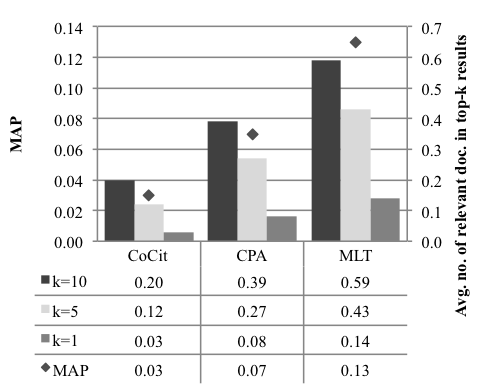
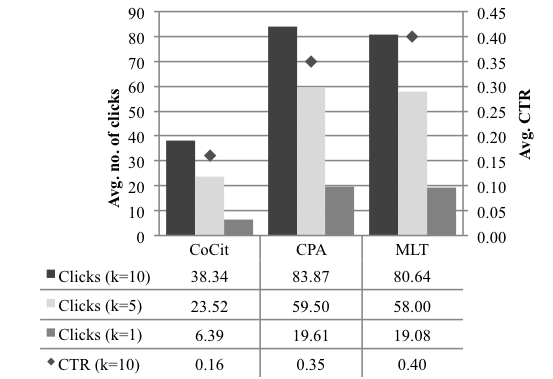
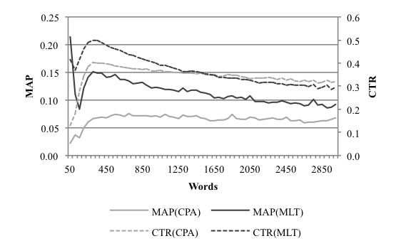
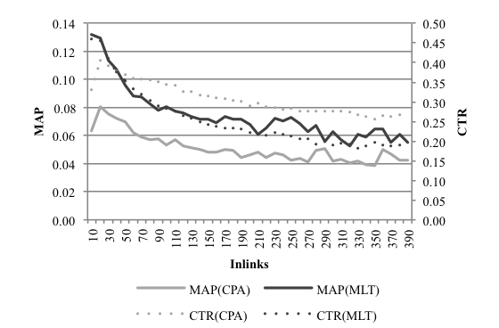

# Evaluation

The evaluation results can be downloaded aggregated as [Excel file](Evaluation.xlsx) or raw as [MySQL dump](https://github.com/wikimedia/citolytics/releases/download/v0.0.2/results.tar.gz):

 - Full MySQL dump (4GB / .tar-file)
 - Single tables (.sql-files)
    - **clickstream_cocit_ci.sql**, **clickstream_mlt_ci.sql**, **clickstream_cpa_ci.sql**
        - Article name
        - Retrieved documents (comma separated)
        - Retrieved documents count
        - Impressions
        - Sum of out clicks
        - Clicks in top-k=10
        - Clicks in top-k=5
        - Clicks in top-k=1
    - **seealso_cpa_ci.sql**, **seealso_cocit_ci.sql**, **seealso_mlt_ci.sql**
        - Article name
        - See also links (comma separated)
        - See also links count
        - Retrieved documents (comma separated)
        - Retrieved documents count
        - Harmonic Reciprocal Rank
        - Top-K score
        - Performance measure (MAP or MRR)
        - Relevant recommendations in top-k=10
        - Relevant recommendations in top-k=5
        - Relevant recommendations in top-k=1
    - **stats.sql**
        - Article name
        - Words
        - Headlines
        - outLinks
        - avgLinkDistance
        - inLinks

## Mean Average Precision

## Click-Trough-Rate

## Performance related to Article Length

## Performance related to In-Links

